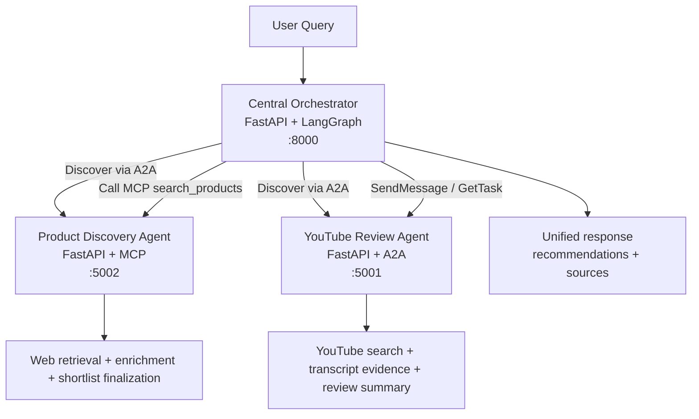

# Federated Multi-Agent System

A federated shopping advisor built with:

- `A2A` for agent discovery and downstream delegation
- `MCP` for Product Discovery execution
- `LangGraph` for orchestration
- `FastAPI` for the backend and demo UI

The system keeps the assignment architecture intact:

- `Central Orchestrator`
- `Product Discovery Agent (MCP-based)`
- `YouTube Product Review Agent`

See [ARCHITECTURE.md](../ARCHITECTURE.md) for the full design walkthrough.

## Architecture



## What The System Does

- Discovers downstream services from A2A Agent Cards
- Uses one structured LLM query-understanding step
- Calls Product Discovery through the MCP interface advertised by the discovered Product Discovery service
- Builds a concrete `1-3` product shortlist before any YouTube fan-out happens
- Sends only finalized products to the YouTube Review Agent
- Returns a unified ranked response with explicit source links
- Exposes a live trace page that shows discovery, routing, shortlist formation, review progress, and synthesis

## How It Works

1. `discover_agents`
   The orchestrator fetches Agent Cards from `/.well-known/agent-card.json` and records the downstream endpoints and skills.

2. `route_tasks`
   GPT-4o-mini interprets the shopper query once, reformulates it when needed, and the orchestrator then assembles routes deterministically from the discovered services.

3. `execute_product_discovery`
   The orchestrator resolves the Product Discovery MCP interface from the discovered Agent Card and calls `search_products` on the already-running Product Discovery service.

   Product Discovery then:
   - expands the query into a small generic retrieval set
   - gathers and enriches candidate pages
   - clusters repeated product entities across sources
   - finalizes up to `3` real products
   - prefers better product/detail links when it can ground them

4. `execute_youtube_reviews`
   Only finalized shortlisted products are sent to the YouTube Review Agent over A2A. The YouTube agent searches videos, ranks them, extracts transcript or description evidence, and builds structured review summaries.

5. `synthesize`
   The orchestrator merges product and review evidence into a grounded final response with:
   - ranked recommendations
   - source links
   - partial-result notes when one path degrades

## Services And Ports

- UI: `http://localhost:8000/`
- Live Trace UI: `http://localhost:8000/trace`
- Orchestrator API: `http://localhost:8000/query`
- Orchestrator status: `http://localhost:8000/status`
- Agent list: `http://localhost:8000/agents`
- YouTube Agent Card: `http://localhost:5001/.well-known/agent-card.json`
- Product Discovery Agent Card: `http://localhost:5002/.well-known/agent-card.json`

## Protocol Use

### A2A

A2A is the inter-agent layer in this project.

- Agents are discovered through `/.well-known/agent-card.json`
- A2A JSON-RPC runs on `/a2a/v1`
- The orchestrator uses `SendMessage` and `GetTask` for downstream A2A work
- The YouTube Review Agent is executed over A2A
- Product Discovery is still discovered through A2A even though its primary execution path is MCP

### MCP

MCP is used for Product Discovery.

- The Product Discovery Agent advertises an MCP interface in its Agent Card
- The orchestrator resolves that MCP endpoint from the discovered card
- The orchestrator calls the running Product Discovery service over MCP HTTP
- The MCP tool name is `search_products`
- The tool returns shortlist-quality `ProductDiscoveryResult` payloads

## Prerequisites

- Python `3.11+`
- `OPENAI_API_KEY`
- `YOUTUBE_API_KEY`

## Setup

PowerShell:

```powershell
cd C:\Users\rprav\Claude\Workfall\Assignment\federated-multi-agent-system
python -m venv .venv
.venv\Scripts\Activate.ps1
pip install -r requirements.txt
Copy-Item .env.example .env
```

Then fill in `.env` with:

- `OPENAI_API_KEY`
- `YOUTUBE_API_KEY`

## Run The Stack

```powershell
python run.py
```

This starts:

- the orchestrator on `:8000`
- the YouTube Review Agent on `:5001`
- the Product Discovery Agent on `:5002`

The launcher waits for service health and downstream readiness checks before declaring the system ready.

## UI

- Main app: `http://localhost:8000/`
- Live trace: `http://localhost:8000/trace`
- FastAPI docs: `http://localhost:8000/docs`

The main app is served by the orchestrator itself, so it uses same-origin API calls and does not need a separate frontend dev server.

## Example Query

```powershell
$body = '{"query": "best wireless earbuds under 100"}'
curl.exe -s -X POST http://localhost:8000/query -H "Content-Type: application/json" -d $body | python -m json.tool
```

Example response shape:

```json
{
  "query": "best wireless earbuds under 100",
  "recommendations": [
    {
      "rank": 1,
      "product_name": "Sony WF-1000XM5",
      "price": "$99.99",
      "rating": "4.5/5",
      "sentiment": "positive",
      "score": 0.91,
      "rationale": "Strong overall balance of price, features, and review sentiment.",
      "pros": ["Strong ANC"],
      "cons": ["Premium pricing"],
      "confidence": 0.89
    }
  ],
  "sources": [
    {
      "type": "product",
      "title": "Sony WF-1000XM5 on Example Merchant",
      "url": "https://example.com/product",
      "agent": "product-discovery"
    },
    {
      "type": "video",
      "title": "Sony WF-1000XM5 review by Audio Lab",
      "url": "https://youtube.com/watch?v=abc123",
      "agent": "youtube-review"
    }
  ],
  "partial": false,
  "notes": null
}
```

## Live Trace

`/trace` is a demo/debug surface for the full orchestration run. It shows:

- discovered agents
- query understanding and routing
- Product Discovery search queries and shortlist formation
- finalized products
- YouTube review targets
- selected videos
- transcript evidence
- final recommendations and source links

## Helpful Endpoints

- `GET /`
- `GET /trace`
- `POST /query`
- `POST /query/trace`
- `GET /query/trace/{run_id}`
- `GET /health`
- `GET /status`
- `GET /agents`
- `GET /.well-known/agent-card.json` on each downstream agent

Common local URLs:

- `GET http://localhost:8000/`
- `GET http://localhost:8000/trace`
- `GET http://localhost:8000/status`
- `GET http://localhost:8000/agents`
- `POST http://localhost:8000/query`

## MCP Tool

The Product Discovery MCP endpoint is:

- `http://localhost:5002/mcp`

The tool name is:

- `search_products`

The repo also includes a stdio MCP helper for local testing:

```powershell
python scripts/test_mcp_stdio.py list
python scripts/test_mcp_stdio.py call "best budget mechanical keyboard"
```

## A2A Contract

- Discovery uses Agent Cards
- JSON-RPC is strictly validated as `2.0`
- Downstream A2A tasks are polled until terminal state
- The YouTube Review Agent returns structured artifacts that feed synthesis
- Product Discovery remains MCP-first, with A2A retained as a resilience fallback path in the orchestrator runtime

## Project Structure

```text
federated-multi-agent-system/
|-- run.py
|-- README.md
|-- requirements.txt
|-- .env.example
|-- common/
|   |-- a2a_client.py
|   |-- a2a_models.py
|   |-- a2a_server.py
|   |-- config.py
|   `-- runtime_helpers.py
|-- agents/
|   |-- orchestrator/
|   |   |-- discovery.py
|   |   |-- graph.py
|   |   |-- product_runtime.py
|   |   |-- review_runtime.py
|   |   |-- routing.py
|   |   |-- runtime.py
|   |   |-- server.py
|   |   |-- synthesis_runtime.py
|   |   `-- trace.py
|   |-- product_discovery/
|   |   |-- agent.py
|   |   |-- mcp_server.py
|   |   |-- pipeline.py
|   |   |-- progress.py
|   |   |-- server.py
|   |   `-- traces.py
|   `-- youtube_review/
|       |-- agent.py
|       `-- server.py
|-- frontend/
|   |-- index.html
|   `-- trace.html
|-- scripts/
|   `-- test_mcp_stdio.py
`-- tests/
```

## Notes

- The final response always exposes a top-level `sources` list.
- Product Discovery is the shortlist authority.
- YouTube reviews happen only after shortlist finalization.
- The system is designed to degrade gracefully and return partial results instead of failing hard when possible.
