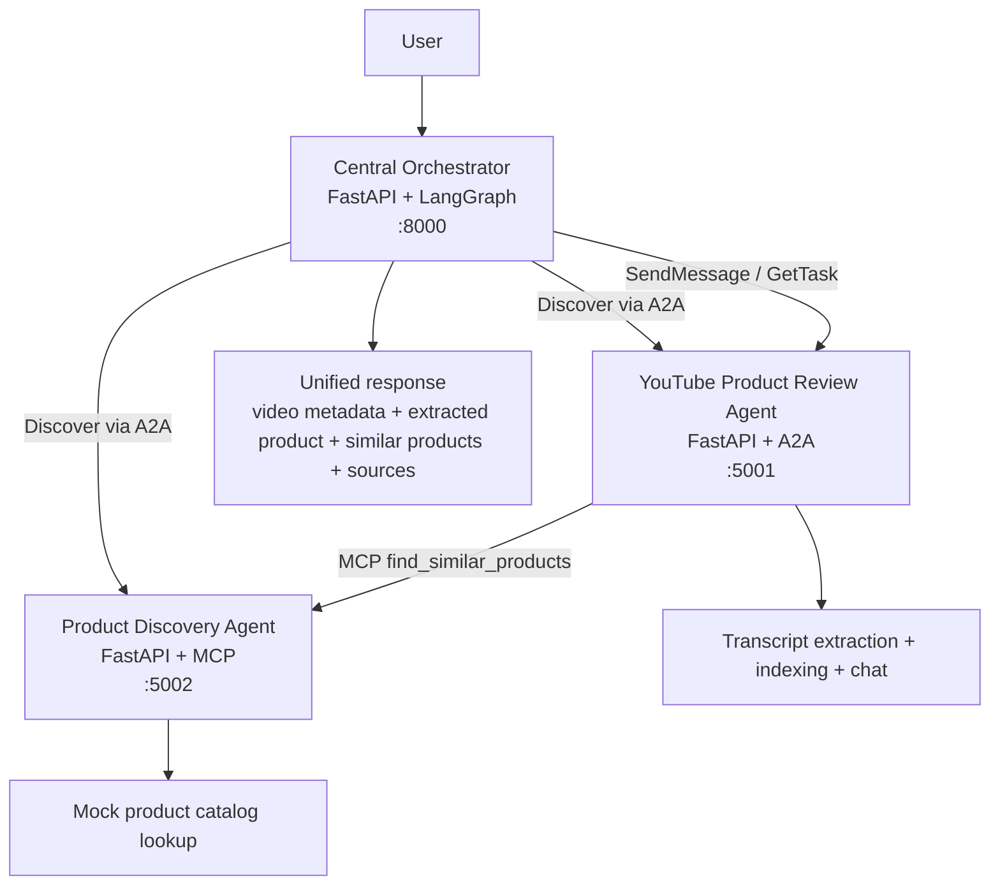

# Federated Multi-Agent System

## Demo

- Demo video: [https://youtu.be/zl8-YQSKATU](https://youtu.be/zl8-YQSKATU)

A PDF-aligned federated multi-agent demo built with:

- `A2A` for agent discovery and task delegation
- `MCP` for Product Discovery tools
- `LangGraph` for orchestration
- `FastAPI` for the services and demo UI
- `Pinecone` for transcript retrieval when credentials are configured

The required architecture stays intact:

- `Central Orchestrator`
- `YouTube Product Review Agent`
- `Product Discovery Agent (MCP-based)`

See [ARCHITECTURE.md](../ARCHITECTURE.md) for the full design walkthrough.

## Primary Flow

The primary demo path now matches the assignment PDF:

1. The user submits a YouTube product review URL.
2. The Central Orchestrator discovers both downstream services through A2A Agent Cards.
3. The orchestrator delegates the URL to the YouTube Product Review Agent over A2A.
4. The YouTube agent:
   - validates the URL
   - fetches video metadata
   - extracts transcript/subtitle text
   - indexes transcript chunks for grounded retrieval
   - supports transcript chat
   - extracts structured product details
   - optionally calls Product Discovery over MCP for similar products
5. The orchestrator returns one unified response with explicit `sources`.

The older shopping-query-first flow is still available as a secondary compatibility path.

## High-Level Architecture



## What The System Does

- discovers downstream services from A2A Agent Cards
- delegates the primary YouTube URL workflow over A2A
- resolves the Product Discovery MCP interface from the discovered Agent Card
- allows the YouTube agent to trigger Product Discovery through MCP with a structured payload
- supports transcript-grounded chat for a single review video
- returns structured product details plus similar products in one final response

## Services And Ports

- UI: `http://localhost:8000/`
- Orchestrator API: `http://localhost:8000/query`
- Orchestrator status: `http://localhost:8000/status`
- Agent list: `http://localhost:8000/agents`
- YouTube Agent Card: `http://localhost:5001/.well-known/agent-card.json`
- Product Discovery Agent Card: `http://localhost:5002/.well-known/agent-card.json`

## Protocol Use

### A2A

A2A is the federation layer in this repo.

- agent cards are discovered through `/.well-known/agent-card.json`
- A2A JSON-RPC is exposed on `/a2a/v1`
- the orchestrator delegates the primary YouTube URL task over A2A
- the orchestrator still discovers the Product Discovery Agent through A2A even though Product Discovery is executed through MCP

### MCP

Product Discovery exposes MCP on the running service instance.

Available MCP tools:

- `search_products`
- `find_similar_products`

The new PDF-aligned path uses `find_similar_products`, which accepts structured product details extracted from the review video and returns catalog-style JSON.

You can still inspect the Product Discovery MCP tool surface locally:

```powershell
python scripts/test_mcp_stdio.py list
```

## Prerequisites

- Python `3.11+`
- `OPENAI_API_KEY`
- `YOUTUBE_API_KEY`
- `PINECONE_API_KEY` for real Pinecone indexing

If Pinecone credentials are not configured, the YouTube agent keeps working with an in-memory transcript index for local development and tests.

## Setup

PowerShell:

```powershell
cd C:\Users\rprav\Claude\Workfall\Assignment\federated-multi-agent-system
python -m venv .venv
.venv\Scripts\Activate.ps1
pip install -r requirements.txt
Copy-Item .env.example .env
```

Then fill in `.env` with:

- `OPENAI_API_KEY`
- `YOUTUBE_API_KEY`
- `PINECONE_API_KEY`

Optional settings:

- `OPENAI_MODEL`
- `OPENAI_EMBEDDING_MODEL`
- `PINECONE_INDEX_NAME`
- `PINECONE_CLOUD`
- `PINECONE_REGION`
- `ENABLE_PINECONE`
- `ENABLE_LEGACY_SHOPPING_FLOW`
- `ENABLE_MOCK_PRODUCT_CATALOG`

## Run The Stack

```powershell
python run.py
```

This starts:

- the orchestrator on `:8000`
- the YouTube Product Review Agent on `:5001`
- the Product Discovery Agent on `:5002`

The launcher checks service health and downstream readiness before reporting the stack as ready.

## Main API

### Primary PDF Flow

```powershell
$body = @'
{
  "youtube_url": "https://www.youtube.com/watch?v=abc123",
  "chat_message": "What product is being reviewed and what are its key strengths?",
  "find_similar_products": true
}
'@
curl.exe -s -X POST http://localhost:8000/query -H "Content-Type: application/json" -d $body | python -m json.tool
```

### Legacy Shopping Flow

```powershell
$body = '{"query": "best wireless earbuds under 100"}'
curl.exe -s -X POST http://localhost:8000/query -H "Content-Type: application/json" -d $body | python -m json.tool
```

### Example Response Shape

```json
{
  "query": "https://www.youtube.com/watch?v=abc123",
  "mode": "youtube_video",
  "youtube_url": "https://www.youtube.com/watch?v=abc123",
  "recommendations": [
    {
      "rank": 1,
      "product_name": "Logitech G Pro X Superlight 2",
      "price": "$149.99",
      "rating": "4.6/5",
      "sentiment": null,
      "score": 0.88,
      "rationale": "Selected as a similar product from the structured MCP lookup.",
      "pros": ["Superlight competitive shape"],
      "cons": [],
      "confidence": 0.88
    }
  ],
  "sources": [
    {
      "type": "video",
      "title": "Gaming Mouse Review by Tech Lab",
      "url": "https://www.youtube.com/watch?v=abc123",
      "agent": "youtube-review"
    },
    {
      "type": "product",
      "title": "Logitech G Pro X Superlight 2 on Mock Catalog",
      "url": "https://catalog.example/products/logitech-g-pro-x-superlight-2",
      "agent": "product-discovery"
    }
  ],
  "partial": false,
  "notes": null
}
```

The final payload still explicitly includes `"sources"` so the UI can show exactly where the answer came from.

## Helpful Endpoints

- `GET /`
- `POST /query`
- `POST /video/chat`
- `GET /health`
- `GET /status`
- `GET /agents`

Common local URLs:

- `GET http://localhost:8000/`
- `GET http://localhost:8000/status`

## Project Structure

```text
federated-multi-agent-system/
|-- run.py
|-- README.md
|-- requirements.txt
|-- .env.example
|-- common/
|   |-- config.py
|   |-- a2a_models.py
|   |-- a2a_server.py
|   |-- a2a_client.py
|   `-- runtime_helpers.py
|-- agents/
|   |-- youtube_review/
|   |   |-- agent.py
|   |   |-- video_analysis.py
|   |   |-- rag.py
|   |   |-- sessions.py
|   |   `-- server.py
|   |-- product_discovery/
|   |   |-- agent.py
|   |   |-- catalog.py
|   |   |-- mcp_server.py
|   |   |-- pipeline.py
|   |   |-- traces.py
|   |   `-- server.py
|   `-- orchestrator/
|       |-- discovery.py
|       |-- routing.py
|       |-- graph.py
|       |-- product_runtime.py
|       |-- review_runtime.py
|       |-- video_runtime.py
|       |-- runtime.py
|       |-- synthesis_runtime.py
|       `-- server.py
`-- frontend/
    `-- index.html
```
