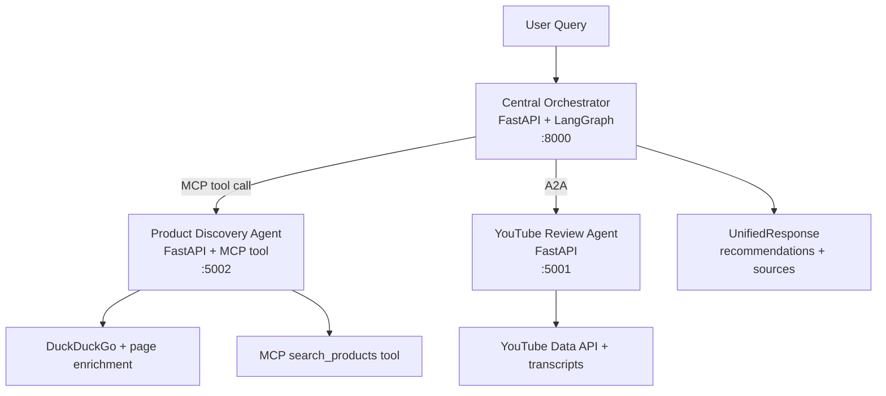

# Federated Multi-Agent System

A federated shopping advisor built with the A2A protocol, LangGraph orchestration, and an MCP-exposed product discovery capability. The system combines product search results, grounded source links, and YouTube review evidence into a unified recommendation response.

See [ARCHITECTURE.md](../ARCHITECTURE.md) for the full design walkthrough.

## Architecture



## What It Does

- The orchestrator discovers downstream agents from their A2A Agent Cards.
- The orchestrator uses structured LLM-based query understanding and routing before executing downstream calls.
- The orchestrator invokes Product Discovery through its MCP `search_products` tool, while still discovering that service through its A2A Agent Card.
- The Product Discovery agent expands the shopper query into a small generic retrieval set, clusters repeated product entities across sources, and returns a grounded 1-3 product shortlist before any review fan-out happens, preferring product-detail links when available and otherwise carrying forward grounded evidence links.
- The YouTube Review agent summarizes recent review videos with sentiment, pros, cons, confidence, and source links.
- The orchestrator synthesizes a structured final response and explicitly lists the grounded links returned by the agents.

## Prerequisites

- Python 3.11+
- An OpenAI API key
- A YouTube Data API v3 key

## Setup

PowerShell:

```powershell
cd federated-multi-agent-system
pip install -r requirements.txt
Copy-Item .env.example .env
```

Then edit `.env` and fill in:

- `OPENAI_API_KEY`
- `YOUTUBE_API_KEY`

## Running The System

Start everything with one command:

```powershell
python run.py
```

This launches:

- Web UI: `http://localhost:8000/`
- Orchestrator: `http://localhost:8000/query`
- YouTube Agent Card: `http://localhost:5001/.well-known/agent-card.json`
- Product Agent Card: `http://localhost:5002/.well-known/agent-card.json`

The frontend is served by the orchestrator itself, so it uses same-origin API calls and can be opened directly in a browser without editing any hostnames.

You can also run services individually:

```powershell
python -m uvicorn agents.youtube_review.server:app --port 5001
python -m uvicorn agents.product_discovery.server:app --port 5002
python -m uvicorn agents.orchestrator.server:app --port 8000
```

## Example Query

```powershell
$body = '{"query": "best wireless earbuds under 100"}'
curl.exe -s -X POST http://localhost:8000/query -H "Content-Type: application/json" -d $body | python -m json.tool
```

Expected response shape:

```json
{
  "query": "best wireless earbuds under 100",
  "recommendations": [
    {
      "rank": 1,
      "product_name": "Sony WF-1000XM5",
      "price": "$99.99",
      "rating": "4.5/5",
      "sentiment": "positive",
      "score": 0.91,
      "rationale": "Strong overall balance of price, features, and review sentiment.",
      "pros": ["Strong ANC"],
      "cons": ["Premium pricing"],
      "confidence": 0.89
    }
  ],
  "sources": [
    {
      "type": "product",
      "title": "Sony WF-1000XM5 on Example Merchant",
      "url": "https://example.com/product",
      "agent": "product-discovery"
    },
    {
      "type": "video",
      "title": "Sony WF-1000XM5 review by Audio Lab",
      "url": "https://youtube.com/watch?v=abc123",
      "agent": "youtube-review"
    }
  ],
  "partial": false,
  "notes": null
}
```

The important Phase 5/6 contract is that the final response includes an explicit top-level `sources` list so the user can see exactly where the product and review evidence came from.

## Helpful Endpoints

- `GET http://localhost:8000/`
- `GET http://localhost:8000/health`
- `GET http://localhost:8000/status`
- `GET http://localhost:8000/agents`
- `GET http://localhost:5001/.well-known/agent-card.json`
- `GET http://localhost:5002/.well-known/agent-card.json`
- `GET http://localhost:5001/health`
- `GET http://localhost:5002/health`

## MCP Tool

The Product Discovery agent exposes `search_products` over MCP at `http://localhost:5002/mcp`, and the orchestrator discovers that MCP interface from the Product Discovery Agent Card before calling the already-running Product Discovery service instance over HTTP. The MCP tool returns at most 3 finalized concrete products so the downstream YouTube fan-out stays focused. For direct local tool testing, the repo also includes a stdio helper path:

List tools:

```powershell
python scripts/test_mcp_stdio.py list
```

Call the tool:

```powershell
python scripts/test_mcp_stdio.py call "best budget mechanical keyboard"
```

The helper script performs the required MCP initialize handshake and uses Content-Length framed stdio messages.

## A2A Usage

- Discovery happens through `/.well-known/agent-card.json`.
- Agent Card `url` values point to the full JSON-RPC endpoint.
- The shared A2A client sends `SendMessage` and `GetTask` directly to downstream A2A agents such as YouTube Review.
- Product Discovery is discovered through A2A but executed through its MCP `search_products` tool on the discovered service instance.
- Non-terminal tasks are polled until they become `completed`, `failed`, `canceled`, or `input-required`.
- Agent artifacts carry the structured review payloads that feed orchestration, while MCP returns structured product payloads for Product Discovery.

## LangGraph Flow

The orchestrator runs this workflow:

1. `discover_agents`
2. `route_tasks`
3. `execute_product_discovery` to build a concrete 1-3 product shortlist
4. `execute_youtube_reviews` only for finalized shortlisted products when appropriate
5. `synthesize`

If one downstream agent fails, the orchestrator still returns partial results and explains the degradation in `notes`.

## Project Structure

```text
federated-multi-agent-system/
|-- run.py
|-- README.md
|-- requirements.txt
|-- .env.example
|-- common/
|   |-- config.py
|   |-- a2a_models.py
|   |-- a2a_server.py
|   `-- a2a_client.py
|-- agents/
|   |-- youtube_review/
|   |   |-- agent.py
|   |   `-- server.py
|   |-- product_discovery/
|   |   |-- agent.py
|   |   |-- mcp_server.py
|   |   `-- server.py
|   `-- orchestrator/
|       |-- routing.py
|       |-- graph.py
|       |-- trace.py
|       `-- server.py
|-- frontend/
|   |-- index.html
|   `-- trace.html
|-- scripts/
|   `-- test_mcp_stdio.py
`-- tests/
```

## Logs

`python run.py` writes one log file per managed service under `.logs/`.

## Notes

- The detailed design document lives one level up at `../ARCHITECTURE.md`.
- Routing uses structured query understanding plus an LLM-guided routing decision.
- Product URLs in the final response are grounded to retrieved candidate evidence.
- The final `sources` list includes links from both product discovery and YouTube review agents.
- `run.py` is designed for clean startup and clean shutdown on Windows as well as other platforms.
